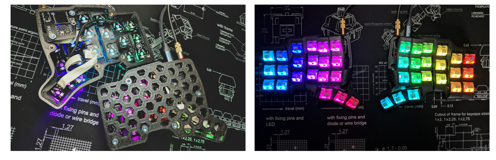
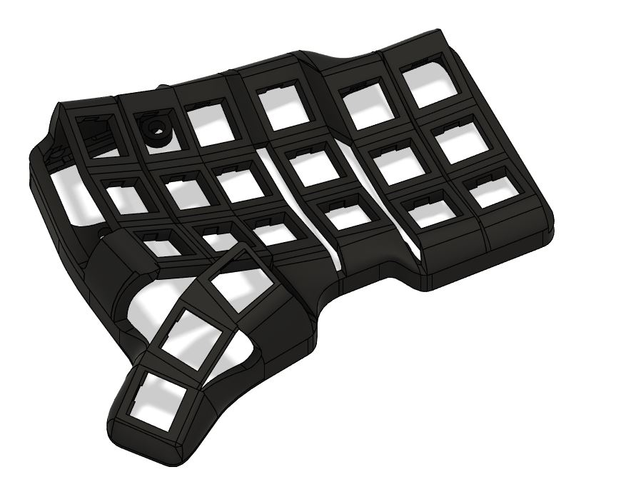

# TBK Mini

A Dactyl Manuform Mini. Silent and compact, with per-key RGB.

# Support me on Patreon

If you like the keyboard, please consider helping me with Patreon: https://www.patreon.com/bastardkb

I post regular updates and hindsight on my work. I work full time on keyboard innovation, and this helps a lot !

# Sourcing the components

For sourcing the components, you have two options:

## Source them yourself

You will need to order the parts from a shop, and order some PCBs directly from the manufacturer.

The Elite-C Adapters are open-source. At this moment, the flexible PCBs are not. Instead, you can use Amoebas.

**Note: please use Elite-C adapter V1.3**

Parts list:

| Part name  | Amount |  Link |
| ------------- | ------------- | ------------- |
| Amoebas  | 42  | |
| Elite-C | 2  | |
| Elite-C adapter PCB V1.4 | 2  | https://github.com/Bastardkb/Elite-C-holder |
| SOD123 Diodes | 42  | |
| Wires |   | 28 AWG recommended |
| M4 8mm Torx Screw | 14  | Conrad |
| M4 screw insert, M4 X D6.0 X L5.0  | 14  | https://fr.aliexpress.com/item/4000232925592.html?spm=a2g0s.12269583.0.0.6aef4f282LZO4v |
| Audio jack, SMD | 2  |  |

If you want RGB, you will also need:

| Part name  | Amount |  Link |
| ------------- | ------------- | ------------- |
| FlexStrip cables | 6  | Farnell |
| 28AWG Cables | 6  | Aliexpress |
| SK6812 Mini-E LEDs | 42  | Aliexpress |

## Get a kit from BastardKB

You can get a full Kit, including case and all PCBs and electronics required on the shop:
https://bastardkb.com/

If you want to print the case yourself, you can also get just the electronics Kit.

# Sourcing the case

The STL, STEP and Fusion files are included in this Github.
Feel free to modify them at length. The files are on a non-commercial license, so this is for personal projects only - please do not use those to sell them.

For sourcing the case, you have two options:

## Print it yourself

Please find detailed instructions on how to print the case here:
https://docs.bastardkb.com/hc/en-us/articles/360020031180-Print-settings-for-Dactyls

## Get a case from BastardKB

You can get a full Kit, including case and all PCBs and electronics required on the shop:
https://bastardkb.com/

The cases are printed at 0.15 mm layer height using Prusament Galaxy Black on a Prusa MK3s.

I check and post-process each case individually to make sure it matches very high quality standards.

# Build guide

Please find detailed build instructions here:
https://docs.bastardkb.com/hc/en-us/articles/360020031340-Kit-contents-and-required-tools

# Finding help

- Discord: https://bastardkb.com/discord
- Website: https://bastardkb.com/
- Docs: https://docs.bastardkb.com

# License

This work is licensed under a Creative Commons Attribution-NonCommercial-ShareAlike 4.0 International License.
